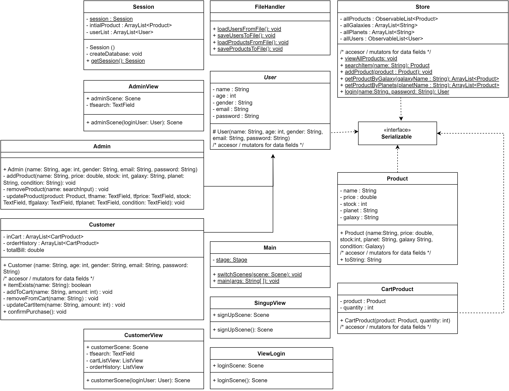
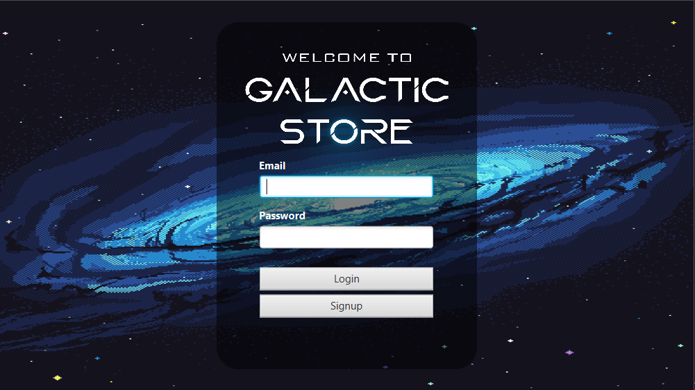
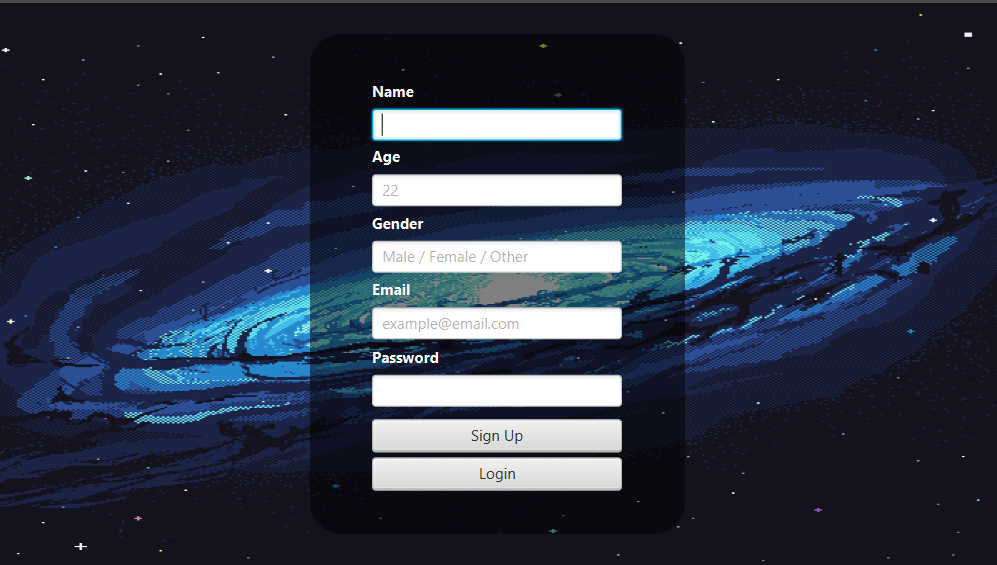
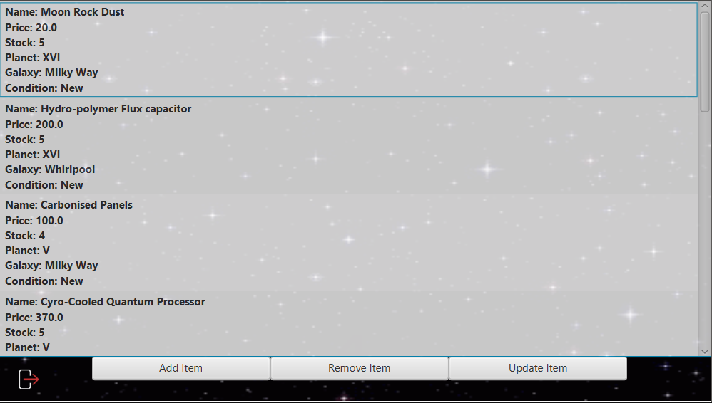
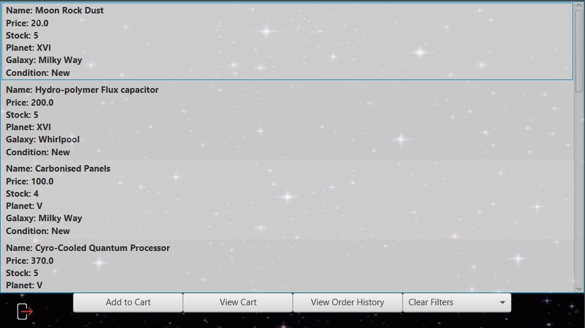

# Galactic Store

## Table of Contents
1. [Overview](#overview)
2. [Features](#features)
3. [Installation](#installation)
4. [Usage](#usage)
5. [UML Class Diagram](#uml-class-diagram)
6. [Screenshots](#screenshots)
7. [Default User List](#default-user-list)
8. [Default Product List](#default-product-list)
9. [Contributors](#contributors)

## Overview

The Galattic Store application is a JavaFX-based desktop application designed to simulate an online store. It provides interfaces for both customers and administrators, allowing the management and purchasing of products, as well as the ability to manage user accounts.

## Features

- **User Registration and Authentication:** The application allows users to create their own accounts, providing necessary details such as name, age, gender, email, and password. The login system authenticates users based on their email and password.

- **User Types:** The system supports two types of users: customers and administrators. Customers can browse products and make purchases, while administrators can manage products and user accounts.

- **Product Management:** Administrators can add, remove, and modify products in the store. Each product includes details such as name, price, and quantity, their `Galaxy` and `Planet` of origin.

- **Purchase System:** Customers can browse the product list, add products to their shopping cart, and proceed to checkout when ready to purchase. The system updates the product quantity accordingly after each purchase.

- **Persistent Data:** The application uses file handling to persistently store user and product data. This allows the application state to be maintained between different sessions. The application also keeps track of user purchase history so they can always come back and look at what purchases they've prevoiusly made.

## Installation

The application requires JavaFX to be installed. If you do not have JavaFX installed, you can run the application using the provided .cmd **(Only for Windows OS)** file by simply double clicking on it.

## Usage

To start the application, simply run the Main class. You will be presented with a login screen. If you do not have an account, you can create one using the "Signup" button.

Once logged in, the application will display a different interface depending on your user type. If you are a customer, you can browse the product list, add products to your shopping cart, and proceed to checkout when ready. If you are an administrator, you can manage products and user accounts.

## UML Class Diagram

## Screenshots
### Login Screen

### Signup Screen

### Admin UI

### Customer UI

## Default Product List

| Product Name                        | Price | Quantity | Planet | Galaxy    | Condition |
| ----------------------------------- | ----- | -------- | ------ | --------- | --------- |
| Moon Rock Dust                      | 20    | 5        | XVI    | Milky Way | New       |
| Hydro-polymer Flux capacitor        | 200   | 5        | XVI    | Whirlpool | New       |
| Carbonised Panels                   | 100   | 5        | V      | Milky Way | New       |
| Cyro-Cooled Quantum Processor       | 370   | 5        | V      | Whirlpool | New       |
| Galactic Graviton Inductor          | 560   | 5        | IX     | Andromeda | Used      |
| Xenon Gas-filled Fusion Core        | 320   | 5        | X      | Whirlpool | New       |
| Neutrino Amplifier Array            | 490   | 5        | II     | Andromeda | New       |
| Anti-Matter Reactor Chamber         | 780   | 5        | VII    | Andromeda | New       |
| Hyperluminal Data Crystal           | 120   | 5        | III    | Whirlpool | Used      |
| Quantum Entangled Transmitter       | 490   | 5        | II     | Andromeda | New       |
| Hyperdimensional Flux capacitor     | 490   | 5        | II     | Milky Way | New       |
| Dark Matter Injector                | 490   | 5        | II     | Andromeda | New       |

## Default User List

| User Type | User Name | Age | Gender | Email                 | Password  |
| --------- | --------- | --- | ------ | --------------------- | --------- |
| Admin     | Admin     | 43  | Male   | admin@gmail.com       | password  |
| Customer  | Customer1 | 30  | Female | customer1@gmail.com   | password  |
| Customer  | Customer2 | 345 | Male   | customer2@gmail.com   | password  |

## Contributors

This project was co-authored with [Tania Hussain](https://github.com/TaniaHussain), she has made indispensable contributions to the frontend of the application. Her work has been instrumental in creating a beautiful, user-friendly and intuitive interface for the application.
